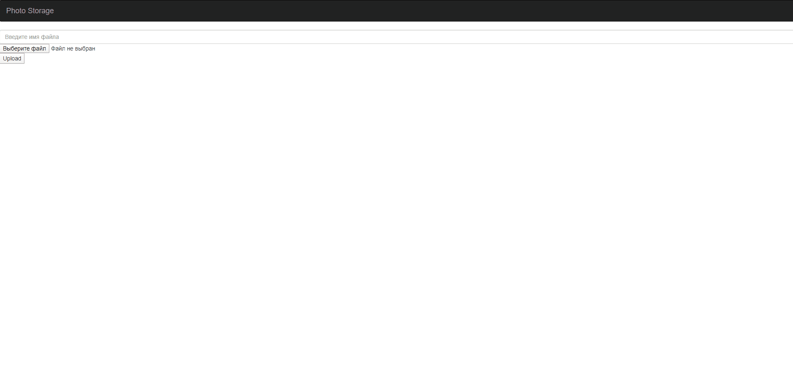
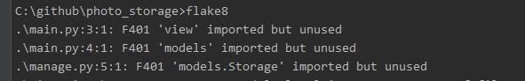

# photo_storage

Небольшое веб приложение - Хранилище фотографий. 

Сервис работает на ``python 3``.

Фреймворк для написания API — ``flask``. 

Фронт на шаблонах ``html`` + ``jinja``

БД ``postgresql``

### Форма загрузки:
- Текстовое поле для ввода названия фото. 
- Выбор файла

### Сетка галереи:
- Превью фото, миниатюра. Превью является ссылкой на оригинальное/полное 
изображение, которое открывается по клику на превью
- Название фото (которое пользователь указывает при загрузке)
- Производитель и модель камеры
- Размер файла в Мб
- Дата создания фото
- Дата загрузки фото
- Кнопка удаления

### Возможности:
- Не сохраняет уже существующие фото
- При наличии дубликата содержимого файла - выдаёт ошибку
- Если загружаемый файл не является изображением — выдаёт ошибку. 
Поддерживаемые расширения находятся в файле ``app_methods.py``
`` 
ALLOWED_EXTENSIONS = ['exif', 'jpg', 'jpeg', 'gif', 'png']
``

### Деплой приложения

- БД деплоится в docker контейнер - ``docker-compose -f deploy_postgres.yml up -d`` 
на порту ``5454``
- Миграция происходит через приложение:
 1) ``python3 manage.py db migrate``
 2) ``python3 manage.py db upgrade``
- Запуск приложения ``python3 main.py``

### Flake8

